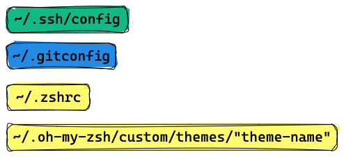

<h1 align="center">Dotfiles</h1>

My dotfiles managed by Chezmoi

  
  
<!--   -->
    

  

## Install

Reference online instructions for installing and setting up [chezmoi](https://www.chezmoi.io/)

`brew install chezmoi`

## Operation

The chezmoi [documentation](https://www.chezmoi.io/quick-start/) covers this in great detail.

## Setup

My initial setup focuses on the following configuration files:

- ssh config
- git config
- zshrc
- vimrc
- custom zsh themes and plugins
- gitignore

I have bashrc, bash_profile, and tmux.conf added but am not using them actively.

## Mac programs I use

- [chezmoi](https://www.chezmoi.io/) - how I am managing all of the ["dotfiles"](https://dotfiles.github.io/)
- [ripgrep](https://github.com/BurntSushi/ripgrep) - awesome
- [fzf](https://github.com/junegunn/fzf) - more awesomeness
- [dust](https://github.com/bootandy/dust) - a `du` program written in rust

## Programs I recently learned about and am trying
- [bat](https://github.com/sharkdp/bat) - like `cat`, but with syntax highlighting
- [bottom](https://github.com/ClementTsang/bottom) - like `top`/`htop`, but shows CPU/memory/disk/network stats at the same time
- [fd](https://github.com/sharkdp/fd) - like `find`, but uses regexe by default and is much faster
- [delta](https://github.com/dandavison/delta)